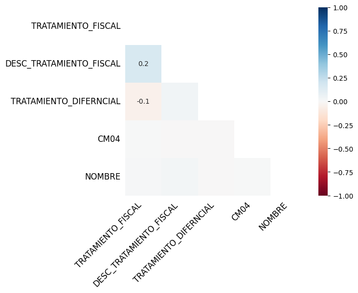

# Diplomatura en ciencia de datos, aprendizaje automático y sus aplicaciones - Edición 2023 - FAMAF (UNC)

## Mentoría 16 - ¿Cómo identificar fuga de ventas? Inteligencia artificial aplicada al sector comercial.

### Análisis y visualización de datos (TP1)

**Integrantes:**
- Canalis, Patricio.
- Chevallier-Boutell, Ignacio José.
- Villarroel Torrez, Daniel.

**Mentores:**
- Gonzalez, Lucía
- Lahoz, Nahuel

---
# Notebook `resolucion01`: exploración inicial

> Tamaño del dataset y significado de los registros

El dataset provisto (denominado `ventas` en la notebook) consta de 431506 registros con información sobre las ventas realizadas por los vendedores dentro de la plataforma de ventas online del cliente. Dicha información viene caracterizada por 19 variables. La definición de cada una de estas variables se tiene en el data statement. En resumen, cada registro informa la suma total de las ventas efectuadas por cada uno de los depósitos de cada vendedor, para un mes y año dados. Por razones de sensibilidad de los datos y la confidencialidad necesaria, las variables que refieren a datos personales (`ID_VENDEDOR` y `NOMBRE`) fueron anonimizadas mediante hasheo.

***Nota:*** el dataset crudo que se levanta en el DataFrame `ventas` está hosteado [aquí](https://www.dropbox.com/scl/fi/iaagjtks3apflrywvomuv/muestra_diplodatos_ventas_2023.csv?dl=1&rlkey=zfsh0bnwbomd4g56bcjysytiy).

> Datos faltantes

Entre las 19 variables disponibles tenemos 5 con valores faltantes: 
1. **CM04:** sólo hay 42 registros (menos del 0.01% del total de registros).
2. **TRATAMIENTO_DIFERNCIAL:** tiene 83058 reigstros (cerca del 20% del total de registros).
3. **DESC_TRATAMIENTO_FISCAL:** tiene 117841 registros (cerca del 30% del total de registros).
4. **TRATAMIENTO_FISCAL:** tiene 403538 registros (más del 90% del total de registros).
5. **NOMBRE:** tiene 430857 registros (casi el total de registros).

> Cardinalidad: valores únicos de las variables

Se determinó cuántos valores únicos hay presentes en cada una de las 19 variables. Además, se analizó la contribución porcentual del valor mayoritario y, en caso de ser posible, la contribución porcentual de los 10 valores mayoritarios. Se tiene que:
1. **ID_VENDEDOR:** tiene 3209 valores diferentes. El valor mayoritario (vendedor f679b20b02309cab33658571f0c8da237f57f732ab96978386a95c2776f07c21) contribuye en un 0.39% de los registros y los 10 primeros en conjunto contribuyen al 2.85%
2. **NOMBRE:** tiene 3199 valores diferentes. El valor mayoritario (nombre b1ccd106f41645af33abb71ae22795538722ff64dfc00ba0648f08da873a7885) contribuye en un 0.39% de los registros y los 10 primeros en conjunto contribuyen al 2.85%.
3. **INSCRIPCION:** tiene 3345 valores diferentes. El valor mayoritario (inscripción 9043011028) contribuye en un 0.39% de los registros y los 10 primeros en conjunto contribuyen al 2.72%.
4. **CATEGORIA:** tiene 5 valores diferentes, pero parece que en realidad son todas la misma categoría, con diferentes formatos de escritura.
5. **CATEGORIA (Ajustado):** tiene un único valor: "COMERCIO AL POR MAYOR Y AL POR MENOR; REPARACION DE VEHÍCULOS AUTOMOTORES Y MOTOCICLETAS". En efecto la variable `CATEGORIA` presentaba un único valor, escrito de formas diferentes.
6. **DESCRIPCION_CATEGORIA:** tiene 245 valores diferentes. El valor mayoritario ("Venta al por mayor de mercancías n.c.p.") contribuye en un 5.21% de los registros y los 10 primeros en conjunto contribuyen al 26.64%.
7. **SUB-CATEGORIA:** las 245 opciones de `DESCRIPCION_CATEGORIA` fueron reducidas a 21 valores diferentes. El valor mayoritario ("Venta de Artículos, productos, accesorios, etc de diversos materiales") contribuye en un 32.51% de los registros y los 10 primeros en conjunto contribuyen al 87.78%. 
8. **DESC_TRATAMIENTO_FISCAL:** tiene 4 valores diferentes. El valor mayoritario (tratamiento fiscal Normal) contribuye en un 94.36% de los registros.
9. **TRATAMIENTO_FISCAL:** tiene 17 valores diferentes: algunos numéricos y otros categóricos. El valor mayoritario (tratamiento fiscal Normal) contribuye en un 45.50% de los registros y los 10 primeros en conjunto contribuyen al 99.16%.
10. **TRATAMIENTO_DIFERNCIAL:** tiene 11 valores diferentes. El valor mayoritario (Art. 21) contribuye en un 34.45% de los registros y los 10 primeros en conjunto contribuyen al 99.52%.
11. **CM04:** tiene un único valor: "Sí".
12. **OMEGA:** tiene un único valor: 1.
13. **AÑO:** tiene 4 valores diferentes: desde 2019 hasta 2022. La contribución mayoritario es del 2021 (29.69%), mientras que el 2022 tiene la contribución minoritaria (15.02%).
14. **MES:** tiene 12 valores diferentes: los 12 meses del año. Junio es el que más contribuye (9.56%). Los 10 meses con mayores contribuciones suman un total del 85.78% de registros, siendo Agosto y Julio los minoritarios (7.12% y 7.10%, respectivamente).
15. **DEPOSITO:** tiene 241 valores diferentes. El valor mayoritario (depósito 469090) contribuye en un 5.21% de los registros y los 10 primeros en conjunto contribuyen al 26.64%.
16. **TOTAL_VENTAS:** tiene 248974 valores diferentes. El valor mayoritario (ventas por un monto total de $0) contribuye en un 41.96% de los registros, mientras que los 10 primeros en conjunto contribuyen al 42.06%.
17. **PORCENTAJE_COMISION_EMPRESA:** tiene 89 valores diferentes. El valor mayoritario (comisión del 4.75%) contribuye en un 19.41% de los registros y los 10 primeros en conjunto contribuyen al 73.27%.
18. **COMISION_EMPRESA:** tiene 244284 valores diferentes. El valor mayoritario (comisión de $0 para el cliente) contribuye en un 42.52% de los registros y los 10 primeros en conjunto contribuyen al 42.56%.
19. **MODELO:** tiene 2 valores diferentes: 0 y 1. Sólo el 0.32% de los registros (valor 1) es considerado **vendedor modelo** por parte del cliente.

> Observaciones hasta ahora

Considerando lo dicho hasta el momento, podemos hacer las siguientes observaciones:
* Si bien la distribución de porcentajes son similares entre `NOMBRE` y `ID_VENDEDOR`, los hashs son diferentes y, además, hay 10 nombres únicos menos. Considerando ésto más el hecho de que hay 649 registros sin valor en la variable `NOMBRE`, podemos pensar que hay 2 situaciones que pueden estar ocurriendo en simultáneo:
    1. Dos vendedores (CUITs) diferentes usaron el mismo nombre (persona física o jurídica) para su negocio.
    2. Hay vendedores (CUITs) que no completaron el campo con el nombre (persona física o jurídica).
* Si bien la distribución de porcentajes son similares entre `INSCRIPCION` y `ID_VENDEDOR`, hay 136 valores únicos más en `INSCRIPCION`. Como esta variable no presenta datos faltantes, vemos que la relación entre ellas no es biyectiva: hay vendedores que tienen más de un número de inscripción asociado. ¿Tiene sentido que la DGR haya provisto 2 códigos de inscripción para un mismo CUIT?
* Sabemos que la variable `DEPOSITO` identifica el depósito de stock desde el cual se efectúa cada una de las ventas. Sin embargo, vemos que hay muchísimos menos valores únicos para esta variable que para `ID_VENDEDOR`. Esto nos lleva a pensar que estos depósitos no necesariamnete son exclusivos de cada vendedor, sino que son comunes para cierto conjunto de vendedores, según algún criterio (localización geográfica, tipo de producto, etcétera). A partir de esto, deberíamos modificar la definición de qué es cada registro:
    - **Antes:** cada registro informa la suma total de las ventas efectuadas por cada uno de los depósitos de cada vendedor, para un mes y año dados.
    - **Ahora:** cada registro informa la suma total de las ventas efectuadas por cada vendedor en alguno de los depósitos donde tiene stock de sus productos, para un mes y año dados.
* Considerando la definición de los registros, el hecho de que `TOTAL_VENTAS` sea igual a $0 implica que dicho vendedor no efectuó ventas a través de la plataforma del cliente que involucraran ese depósito particular, en ese mes y ese año. Una observación análoga se puede hacer para cuando `COMISION_EMPRESA` es igual a $0.
* La cantidad de valores únicos en `DESCRIPCION_CATEGORIA` es similar al de la variable `DEPOSITO`: la primera tiene 4 valores únicos más. Además, la distribución de contribuciones porcentuales son similares en ambas. Retomando la idea de que los depósitos agrupan vendedores según algún criterio, quizás ese criterio venga de la mano de la variable `DESCRIPCION_CATEGORIA`. Sin embargo, esta variable es transforamda en `SUB-CATEGORIA`, donde tiene menos valores únicos. En caso de existir tal relación entre `DESCRIPCION_CATEGORIA` y `DEPOSITO`, se asume que es heredada a `SUB-CATEGORIA`.
* Al mirar con detenimiento los valores únicos de `TRATAMIENTO_FISCAL`, notamos que hay que unificar categorías, como es el caso de 0 y 0.0, por ejemplo. Asimismo se nos presenta la siguiente duda: ¿son todos los valores únicos realmente categorías diferentes entre sí o hay valores diferentes que en realidad reflejan la misma categoría subyacente? Por ejemplo: un vendedor que haya colocado el "1" como tratamiento fiscal, tiene en realidad el mismo tratamiento fiscal que aquel que haya colocado "Especial 1" y esto, a su vez, sea lo mismo que haber colocado "Alícuota agravada". Esta idea se refuerza aún más si pensamos que esta variable es en realidad un desglose de la variable `DESC_TRATAMIENTO_FISCAL`, la cual contiene solamente 4 valores únicos.
* Tanto la variable `TRATAMIENTO_FISCAL` como la variable `DESC_TRATAMIENTO_FISCAL` presentan valores faltantes: faltan 27968 y 313665 valores respectivamente. El gráfico de matriz generado por la librería `missingno` muestra los valores ordenados por `ID_VENDEDOR`. Podemos ver que siempre que falta un dato en `TRATAMIENTO_FISCAL`, también falta en `DESC_TRATAMIENTO_FISCAL`, pero la recíproca no es cierta: cuando falta un dato en `DESC_TRATAMIENTO_FISCAL`, en la mayoría de los casos sí está presente el dato en `TRATAMIENTO_FISCAL`. Por otro lado, vemos que hay ocasiones donde falta el valor en `TRATAMIENTO_FISCAL`, pero aparece un valor en `TRATAMIENTO_DIFERNCIAL`. En el sentido opuesto, no hay una relación muy clara.

    

    Estas ideas queda clara cuando pasamos al mapa de calor de `missingno`, el cual mide la correlación de nulidad, *i.e.* qué tan fuerte la presencia (o ausencia) de una variable afecta la presencia de otra. Las variables que están completamente llenas o completamente vacías no presentan correlación significativa, así que quedan automáticamente descartadas de la gráfica. Además, la gráfica sólo completa las correlaciones en la triangular inferior. Si bien son correlaciones débiles, la gráfica nos indica:
    * Un valor de +0.2 entre `TRATAMIENTO_FISCAL` y `DESC_TRATAMIENTO_FISCAL`: existe una baja probabilidad de que cuando falte un dato en `TRATAMIENTO_FISCAL`, también falte en `DESC_TRATAMIENTO_FISCAL`.
    * Un valor de -0.1 entre `TRATAMIENTO_FISCAL` y `TRATAMIENTO_DIFERNCIAL`: existe una (aún más) baja probabildiad de que cuando falte un dato en `TRATAMIENTO_FISCAL`, no falte en `TRATAMIENTO_DIFERNCIAL`.
    * Entre las demás variables con valores faltantes la correlación es inexistente.

    
* Respecto a la variable `TRATAMIENTO_DIFERNCIAL`, notamos que hay vendedores a los que se le aplica simultáneamente 2 artículos (Arts. 19 y 20), siendo que hay otros a los que se les aplica estos mismos artículos, pero por separado. No hay que perder de vista esto a la hora de hacer análisis.
* La falta de información en las variables `CM04` y `TRATAMIENTO_DIFERNCIAL` es en realidad información, ya que se trata de los complementos:
    * En el caso de `CM04` los datos faltantes corresponden a que esas operaciones no forman parte de convenios multilaterales.
    * En el caso de `TRATAMIENTO_DIFERNCIAL` los datos faltantes corresponden a que esas operaciones no reciben un tratamiento fiscal especial.
* Finalmente, como se indica en el data statement, la variable `OMEGA` tiene un único valor ya que el dataset provisto es en realidad lo que surge de filtrar un dataset más grande bajo el filtro de `OMEGA` igual a 1.

Concluimos esta sección analizando por qué pandas nos da el DtypeWarning con las variables `TRATAMIENTO_FISCAL`, `DESC_TRATAMIENTO_FISCAL` y `CM04`. Aunque las 3 variables poseen valores faltantes, en los 3 casos vemos que toman valores del tipo int64. Desconocemos entonces el origen de este aviso.

> Descarte de variables

En base a lo visto hasta acá, se podría prescindir de:
* `NOMBRE` ya que tiene la misma información que `ID_VENDEDOR`, pero puede tener problemas de degeneración.
* `CATEGORIA` ya que fue reemplazada por `CATEGORIA (Ajustado)`.
* `DESCRIPCION_CATEGORIA` ya que fue reemplazada por `SUB-CATEGORIA`,
* `CATEGORIA (Ajustado)` y `OMEGA` ya que presentan un único valor posible, no aportando información estadística.

El dataset resultante (denominado `ventas_clean` en la notebook) consta entonces de los 431506 registros, pero ahora con 14 variables. El mismo debe usarse entonces teniendo en cuenta el siguiente disclaimer:  *Todos los registros en este dataset fueron filtrados de un dataset mayor según la categoría "COMERCIO AL POR MAYOR Y AL POR MENOR; REPARACION DE VEHÍCULOS AUTOMOTORES Y MOTOCICLETAS" y Omega = 1*. 

> Imputación de valores faltantes

Se imputaron en `ventas_clean` los valores faltantes en las variables `CM04` y `TRATAMIENTO_DIFERNCIAL` completando con el valor "No". De este modo, las únicas variables que aún tienen valores faltantes son `DESC_TRATAMIENTO_FISCAL` y `TRATAMIENTO_FISCAL`: siguen manteniendo una correlación de nuldiad de +0.2. Por su parte, la correlación de nulidad entre `TRATAMIENTO_FISCAL` y `TRATAMIENTO_DIFERNCIAL` desaparece.

> Simplificación de variables

Se modifican los nombres de las variables para facilitar su manipulación en el código. Para ello, se usó el siguiente diccionario:
* `ID_VENDEDOR` >>> `ID`.
* `INSCRIPCION` >>> `DGR`.
* `SUB-CATEGORIA` >>> `Categoria`.
* `DESC_TRATAMIENTO_FISCAL` >>> `Trat_Fisc_Agg`.
* `TRATAMIENTO_FISCAL` >>> `Trat_Fisc`.
* `TRATAMIENTO_DIFERNCIAL` >>> `Trat_Dif`.
* `CM04` >>> `CM`.
* `AÑO` >>> `Año`.
* `MES` >>> `Mes`.
* `DEPOSITO` >>> `Deposito`.
* `TOTAL_VENTAS` >>> `Ventas`.
* `PORCENTAJE_COMISION_EMPRESA` >>> `Alicuota`.
* `COMISION_EMPRESA` >>> `Comision`.
* `MODELO` >>> `Modelo`.

> Simplificación de valores

Existen variables cuyos valores está expresados de manera tal que complejizan el análisis, complicando tanto su manipulación como la lectura e interpretación de tablas y gráficos. Pretendemos eliminar esta capa de complejidad innecesaria, transformando las variables de alguna manera. Dichas variables son:
* Variables con valores tipo string o entero, pero que en realidad pueden tomarse como indicadoras: `ID`, `DGR`, `Deposito` y `CM`. En los 3 primeros casos, se pretende mapear el valor original a un entero, considerando simplemente el orden de aparación en el propio dataset. En el caso de `CM` se asignará "Si" >> 1 y "No" >> 0.
* Variables con valores que parecen diferentes, pero en realidad son el mismo escrito en formatos diferentes: `Trat_Fisc`.
* Variables cuyos valores pueden escribirse de forma más sencilla: `Trat_Fisc`, `Trat_Fisc_Agg`, `Trat_Dif` y `Categoria`.

Los diccionarios usados en los 2 últimos puntos se pueden ver en la notebook.

***Nota:*** el dataset resultante de todas estas modificaciones asignado en el DataFrame `ven_cln_map` está hosteado [aquí](https://www.dropbox.com/scl/fi/684jriu2g52lqyv45z53s/ven_cln_map.csv?dl=1&rlkey=hr7lcqja46a9fj5bdx7ofdgah). Cabe destacar que el dataset crudo pesaba 220 MB y este nuevo dataset pesa 31 MB.

---
# Notebook `resolucion02`: 

---

> Cosas en el tintero

* Ver qué `ID_VENDEDOR` se agrupan en qué `DEPOSITO`.
* Ver tratamiento que se hace con $0 en `TOTAL_VENTAS` y `COMISION_EMPRESA`.
* `TRATAMIENTO_FISCAL` hay que unificar categorías
* `TRATAMIENTO_FISCAL` vs `DESC_TRATAMIENTO_FISCAL`
* `TRATAMIENTO_DIFERNCIAL` simplificar nombres de artículos
* Imputar `TRATAMIENTO_DIFERNCIAL` y `CM04`

* Descatar `NOMBRE` y quedarse con `ID_VENDEDOR`.
* Descartar `OMEGA`
* ¿Tiene sentido que la DGR haya provisto 2 códigos de `INSCRIPCION` para un mismo `ID_VENDEDOR`?

* Simplificación de variables

> Cosas que aún no se ubicaron pero no hay que olvidar

* Esto nos lleva a que `NOMBRE` es candidata a ser descartada.
* valores negativos son crédito o error
* Simplificar/unificar valores
* ver meet seguimiento
