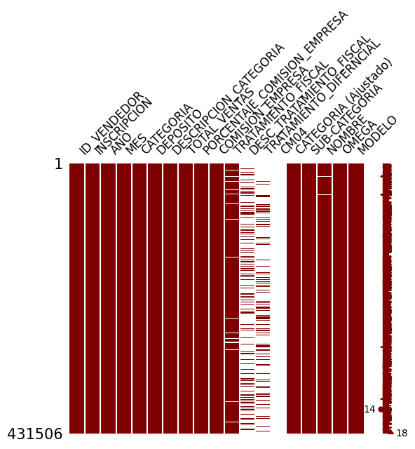
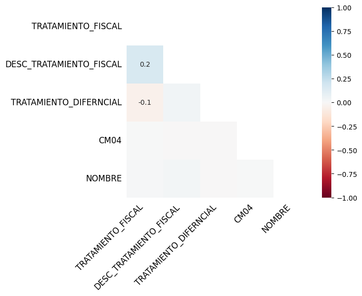
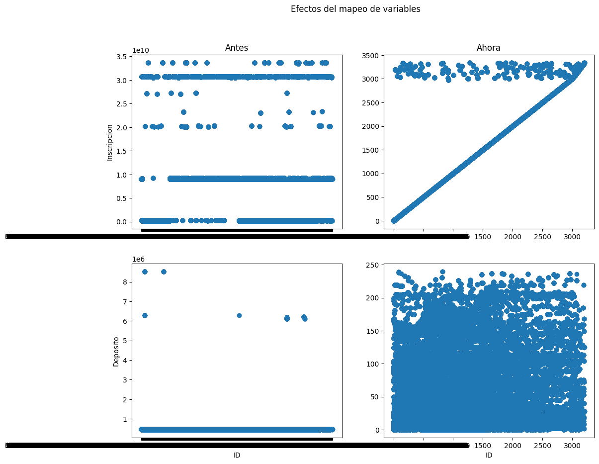
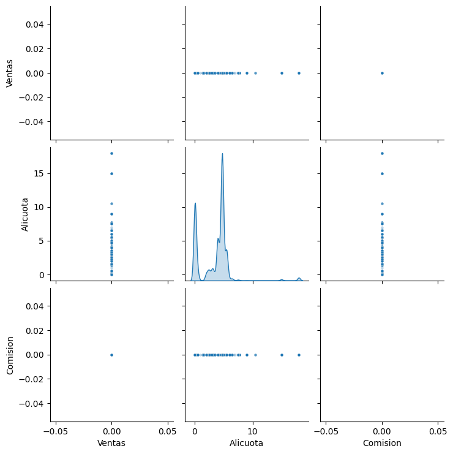
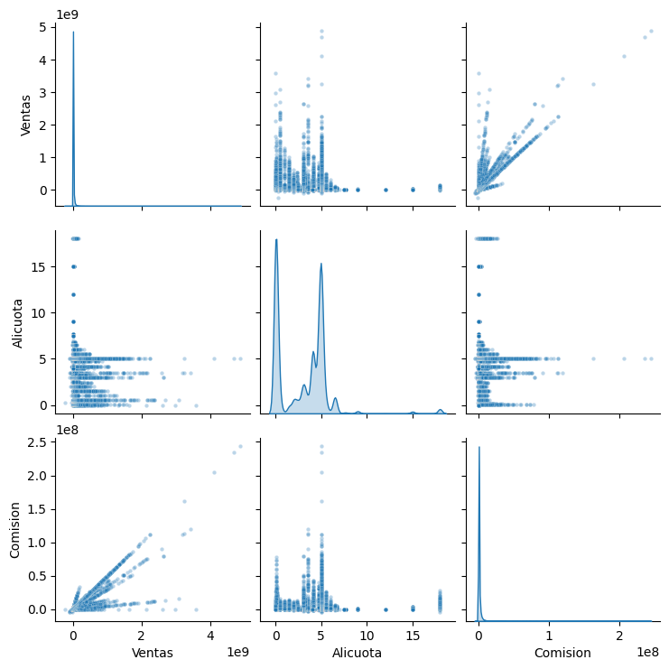
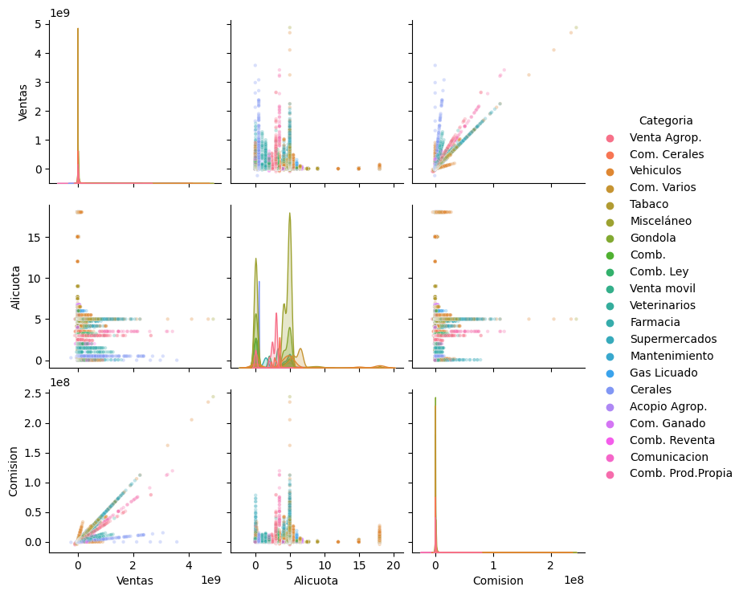
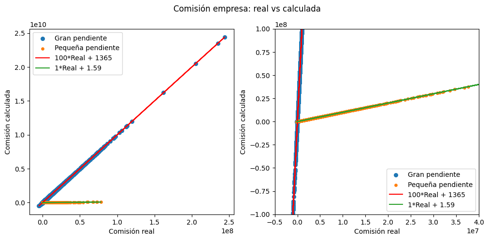
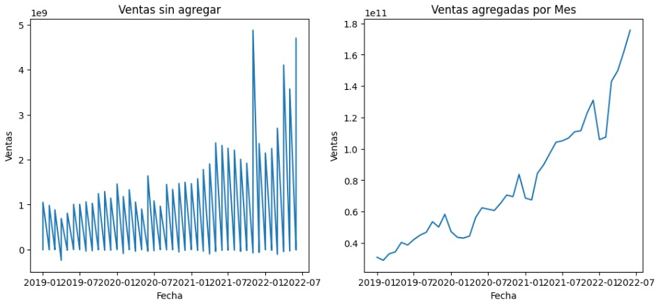
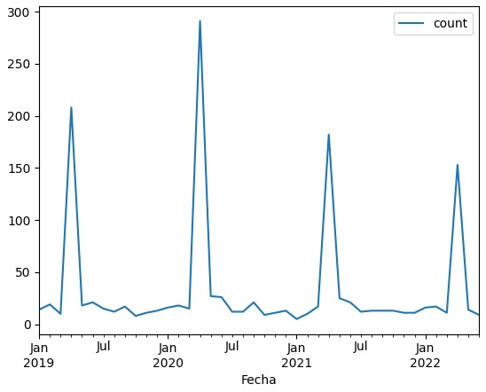

# Diplomatura en ciencia de datos, aprendizaje automático y sus aplicaciones - Edición 2023 - FAMAF (UNC)

## Mentoría 16 - ¿Cómo identificar fuga de ventas? Inteligencia artificial aplicada al sector comercial.

### Análisis y visualización de datos (TP1)

**Integrantes:**
- Canalis, Patricio.
- Chevallier-Boutell, Ignacio José.
- Villarroel Torrez, Daniel.

**Mentores:**
- Gonzalez, Lucía
- Lahoz, Nahuel

---
# Notebook `resolucion01`: exploración inicial

## Tamaño del dataset y significado de los registros

El dataset provisto (denominado `ventas` en la notebook) consta de 431506 registros con información sobre las ventas realizadas por los vendedores dentro de la plataforma de ventas online del cliente. Dicha información viene caracterizada por 19 variables. La definición de cada una de estas variables se tiene en el data statement. En resumen, cada registro informa la suma total de las ventas efectuadas por cada uno de los depósitos de cada vendedor, para un mes y año dados. Por razones de sensibilidad de los datos y la confidencialidad necesaria, las variables que refieren a datos personales (`ID_VENDEDOR` y `NOMBRE`) fueron anonimizadas mediante hasheo.

***Nota:*** el dataset crudo que se levanta en el DataFrame `ventas` está hosteado [aquí](https://www.dropbox.com/scl/fi/iaagjtks3apflrywvomuv/muestra_diplodatos_ventas_2023.csv?dl=1&rlkey=zfsh0bnwbomd4g56bcjysytiy).

## Datos faltantes

Entre las 19 variables disponibles tenemos 5 con valores faltantes: 
1. **CM04:** sólo hay 42 registros (menos del 0.01% del total de registros).
2. **TRATAMIENTO_DIFERNCIAL:** tiene 83058 reigstros (cerca del 20% del total de registros).
3. **DESC_TRATAMIENTO_FISCAL:** tiene 117841 registros (cerca del 30% del total de registros).
4. **TRATAMIENTO_FISCAL:** tiene 403538 registros (más del 90% del total de registros).
5. **NOMBRE:** tiene 430857 registros (casi el total de registros).

## Cardinalidad: valores únicos de las variables

Se determinó cuántos valores únicos hay presentes en cada una de las 19 variables. Además, se analizó la contribución porcentual del valor mayoritario y, en caso de ser posible, la contribución porcentual de los 10 valores mayoritarios. Se tiene que:
1. **ID_VENDEDOR:** tiene 3209 valores diferentes. El valor mayoritario (vendedor f679b20b02309cab33658571f0c8da237f57f732ab96978386a95c2776f07c21) contribuye en un 0.39% de los registros y los 10 primeros en conjunto contribuyen al 2.85%
2. **NOMBRE:** tiene 3199 valores diferentes. El valor mayoritario (nombre b1ccd106f41645af33abb71ae22795538722ff64dfc00ba0648f08da873a7885) contribuye en un 0.39% de los registros y los 10 primeros en conjunto contribuyen al 2.85%.
3. **INSCRIPCION:** tiene 3345 valores diferentes. El valor mayoritario (inscripción 9043011028) contribuye en un 0.39% de los registros y los 10 primeros en conjunto contribuyen al 2.72%.
4. **CATEGORIA:** tiene 5 valores diferentes, pero parece que en realidad son todas la misma categoría, con diferentes formatos de escritura.
5. **CATEGORIA (Ajustado):** tiene un único valor: "COMERCIO AL POR MAYOR Y AL POR MENOR; REPARACION DE VEHÍCULOS AUTOMOTORES Y MOTOCICLETAS". En efecto la variable `CATEGORIA` presentaba un único valor, escrito de formas diferentes.
6. **DESCRIPCION_CATEGORIA:** tiene 245 valores diferentes. El valor mayoritario ("Venta al por mayor de mercancías n.c.p.") contribuye en un 5.21% de los registros y los 10 primeros en conjunto contribuyen al 26.64%.
7. **SUB-CATEGORIA:** las 245 opciones de `DESCRIPCION_CATEGORIA` fueron reducidas a 21 valores diferentes. El valor mayoritario ("Venta de Artículos, productos, accesorios, etc de diversos materiales") contribuye en un 32.51% de los registros y los 10 primeros en conjunto contribuyen al 87.78%. 
8. **DESC_TRATAMIENTO_FISCAL:** tiene 4 valores diferentes. El valor mayoritario (tratamiento fiscal Normal) contribuye en un 94.36% de los registros.
9. **TRATAMIENTO_FISCAL:** tiene 17 valores diferentes: algunos numéricos y otros categóricos. El valor mayoritario (tratamiento fiscal Normal) contribuye en un 45.50% de los registros y los 10 primeros en conjunto contribuyen al 99.16%.
10. **TRATAMIENTO_DIFERNCIAL:** tiene 11 valores diferentes. El valor mayoritario (Art. 21) contribuye en un 34.45% de los registros y los 10 primeros en conjunto contribuyen al 99.52%.
11. **CM04:** tiene un único valor: "Sí".
12. **OMEGA:** tiene un único valor: 1.
13. **AÑO:** tiene 4 valores diferentes: desde 2019 hasta 2022. La contribución mayoritario es del 2021 (29.69%), mientras que el 2022 tiene la contribución minoritaria (15.02%).
14. **MES:** tiene 12 valores diferentes: los 12 meses del año. Junio es el que más contribuye (9.56%). Los 10 meses con mayores contribuciones suman un total del 85.78% de registros, siendo Agosto y Julio los minoritarios (7.12% y 7.10%, respectivamente).
15. **DEPOSITO:** tiene 241 valores diferentes. El valor mayoritario (depósito 469090) contribuye en un 5.21% de los registros y los 10 primeros en conjunto contribuyen al 26.64%.
16. **TOTAL_VENTAS:** tiene 248974 valores diferentes. El valor mayoritario (ventas por un monto total de $0) contribuye en un 41.96% de los registros, mientras que los 10 primeros en conjunto contribuyen al 42.06%.
17. **PORCENTAJE_COMISION_EMPRESA:** tiene 89 valores diferentes. El valor mayoritario (comisión del 4.75%) contribuye en un 19.41% de los registros y los 10 primeros en conjunto contribuyen al 73.27%.
18. **COMISION_EMPRESA:** tiene 244284 valores diferentes. El valor mayoritario (comisión de $0 para el cliente) contribuye en un 42.52% de los registros y los 10 primeros en conjunto contribuyen al 42.56%.
19. **MODELO:** tiene 2 valores diferentes: 0 y 1. Sólo el 0.32% de los registros (valor 1) es considerado **vendedor modelo** por parte del cliente.

## Observaciones hasta ahora

Considerando lo dicho hasta el momento, podemos hacer las siguientes observaciones:
* Si bien la distribución de porcentajes son similares entre `NOMBRE` y `ID_VENDEDOR`, los hashs son diferentes y, además, hay 10 nombres únicos menos. Considerando ésto más el hecho de que hay 649 registros sin valor en la variable `NOMBRE`, podemos pensar que hay 2 situaciones que pueden estar ocurriendo en simultáneo:
    1. Dos vendedores (CUITs) diferentes usaron el mismo nombre (persona física o jurídica) para su negocio.
    2. Hay vendedores (CUITs) que no completaron el campo con el nombre (persona física o jurídica).
* Si bien la distribución de porcentajes son similares entre `INSCRIPCION` y `ID_VENDEDOR`, hay 136 valores únicos más en `INSCRIPCION`. Como esta variable no presenta datos faltantes, vemos que la relación entre ellas no es biyectiva: hay vendedores que tienen más de un número de inscripción asociado, lo cual puede deberse a la manera en la que funciona la plataforma del cliente.
* Sabemos que la variable `DEPOSITO` identifica el depósito de stock desde el cual se efectúa cada una de las ventas. Sin embargo, vemos que hay muchísimos menos valores únicos para esta variable que para `ID_VENDEDOR`. Esto nos lleva a pensar que estos depósitos no necesariamnete son exclusivos de cada vendedor, sino que son comunes para cierto conjunto de vendedores, según algún criterio (localización geográfica, tipo de producto, etcétera). A partir de esto, deberíamos modificar la definición de qué es cada registro:
    - **Antes:** cada registro informa la suma total de las ventas efectuadas por cada uno de los depósitos de cada vendedor, para un mes y año dados.
    - **Ahora:** cada registro informa la suma total de las ventas efectuadas por cada vendedor en alguno de los depósitos donde tiene stock de sus productos, para un mes y año dados.
* Considerando la definición de los registros, el hecho de que `TOTAL_VENTAS` sea igual a $0 implica que dicho vendedor no efectuó ventas a través de la plataforma del cliente que involucraran ese depósito particular, en ese mes y ese año. Una observación análoga se puede hacer para cuando `COMISION_EMPRESA` es igual a $0.
* La cantidad de valores únicos en `DESCRIPCION_CATEGORIA` es similar al de la variable `DEPOSITO`: la primera tiene 4 valores únicos más. Además, la distribución de contribuciones porcentuales son similares en ambas. Retomando la idea de que los depósitos agrupan vendedores según algún criterio, quizás ese criterio venga de la mano de la variable `DESCRIPCION_CATEGORIA`. Sin embargo, esta variable es transforamda en `SUB-CATEGORIA`, donde tiene menos valores únicos. En caso de existir tal relación entre `DESCRIPCION_CATEGORIA` y `DEPOSITO`, se asume que es heredada a `SUB-CATEGORIA`.
* Al mirar con detenimiento los valores únicos de `TRATAMIENTO_FISCAL`, notamos que hay que unificar categorías, como es el caso de 0 y 0.0, por ejemplo. No olvidar que esta variable es un desglose de la variable `DESC_TRATAMIENTO_FISCAL`, la cual contiene solamente 4 valores únicos.
* Tanto la variable `TRATAMIENTO_FISCAL` como la variable `DESC_TRATAMIENTO_FISCAL` presentan valores faltantes: faltan 27968 y 313665 valores respectivamente. El gráfico de matriz generado por la librería `missingno` muestra los valores ordenados por `ID_VENDEDOR`. Podemos ver que siempre que falta un dato en `TRATAMIENTO_FISCAL`, también falta en `DESC_TRATAMIENTO_FISCAL`, pero la recíproca no es cierta: cuando falta un dato en `DESC_TRATAMIENTO_FISCAL`, en la mayoría de los casos sí está presente el dato en `TRATAMIENTO_FISCAL`. Por otro lado, vemos que hay ocasiones donde falta el valor en `TRATAMIENTO_FISCAL`, pero aparece un valor en `TRATAMIENTO_DIFERNCIAL`. En el sentido opuesto, no hay una relación muy clara.

    

    Estas ideas quedan claras cuando pasamos al mapa de calor de `missingno`, el cual mide la correlación de nulidad, *i.e.* qué tan fuerte la presencia (o ausencia) de una variable afecta la presencia de otra. Las variables que están completamente llenas o completamente vacías no presentan correlación significativa, así que quedan automáticamente descartadas de la gráfica. Además, la gráfica sólo completa las correlaciones en la triangular inferior. Si bien son correlaciones débiles, la gráfica nos indica:
    * Un valor de +0.2 entre `TRATAMIENTO_FISCAL` y `DESC_TRATAMIENTO_FISCAL`: existe una baja probabilidad de que cuando falte un dato en `TRATAMIENTO_FISCAL`, también falte en `DESC_TRATAMIENTO_FISCAL`.
    * Un valor de -0.1 entre `TRATAMIENTO_FISCAL` y `TRATAMIENTO_DIFERNCIAL`: existe una (aún más) baja probabildiad de que cuando falte un dato en `TRATAMIENTO_FISCAL`, no falte en `TRATAMIENTO_DIFERNCIAL`.
    * Entre las demás variables con valores faltantes la correlación es inexistente.

    
* Respecto a la variable `TRATAMIENTO_DIFERNCIAL`, notamos que hay vendedores a los que se le aplica simultáneamente 2 artículos (Arts. 19 y 20), siendo que hay otros a los que se les aplica estos mismos artículos, pero por separado. No hay que perder de vista esto a la hora de hacer análisis.
* La falta de información en las variables `CM04` y `TRATAMIENTO_DIFERNCIAL` es en realidad información, ya que se trata de los complementos:
    * En el caso de `CM04` los datos faltantes corresponden a que esas operaciones no forman parte de convenios multilaterales.
    * En el caso de `TRATAMIENTO_DIFERNCIAL` los datos faltantes corresponden a que esas operaciones no reciben un tratamiento fiscal especial.
* Finalmente, como se indica en el data statement, la variable `OMEGA` tiene un único valor ya que el dataset provisto es en realidad lo que surge de filtrar un dataset más grande bajo el filtro de `OMEGA` igual a 1.

Concluimos esta sección analizando por qué pandas nos da el DtypeWarning con las variables `TRATAMIENTO_FISCAL`, `DESC_TRATAMIENTO_FISCAL` y `CM04`. Aunque las 3 variables poseen valores faltantes, en los 3 casos vemos que toman valores del tipo int64. Desconocemos entonces el origen de este aviso.

## Descarte de variables

En base a lo visto hasta acá, se podría prescindir de:
* `NOMBRE` ya que tiene la misma información que `ID_VENDEDOR`, pero puede tener problemas de degeneración.
* `CATEGORIA` ya que fue reemplazada por `CATEGORIA (Ajustado)`.
* `DESCRIPCION_CATEGORIA` ya que fue reemplazada por `SUB-CATEGORIA`,
* `CATEGORIA (Ajustado)` y `OMEGA` ya que presentan un único valor posible, no aportando información estadística.

El dataset resultante (denominado `ventas_clean` en la notebook) consta entonces de los 431506 registros, pero ahora con 14 variables. El mismo debe usarse entonces teniendo en cuenta el siguiente disclaimer: <span style="color:red"> *Todos los registros en este dataset fueron filtrados de un dataset mayor según la categoría "COMERCIO AL POR MAYOR Y AL POR MENOR; REPARACION DE VEHÍCULOS AUTOMOTORES Y MOTOCICLETAS" y Omega = 1*. </span>

## Imputación de valores faltantes

Se imputaron en `ventas_clean` los valores faltantes en las variables `CM04` y `TRATAMIENTO_DIFERNCIAL` completando con el valor "No". De este modo, las únicas variables que aún tienen valores faltantes son `DESC_TRATAMIENTO_FISCAL` y `TRATAMIENTO_FISCAL`: siguen manteniendo una correlación de nuldiad de +0.2. Por su parte, la correlación de nulidad entre `TRATAMIENTO_FISCAL` y `TRATAMIENTO_DIFERNCIAL` desaparece.

## Simplificación de variables

Se modifican los nombres de las variables para facilitar su manipulación en el código. Para ello, se usó el siguiente diccionario (/references/column_dict.json):

```
{
    "ID_VENDEDOR": "ID",
    "INSCRIPCION": "Inscripcion",
    "SUB-CATEGORIA": "Categoria",
    "DESC_TRATAMIENTO_FISCAL": "Trat_Fisc_Agg",
    "TRATAMIENTO_FISCAL": "Trat_Fisc",
    "TRATAMIENTO_DIFERNCIAL": "Trat_Dif",
    "CM04": "CM",
    "AÑO": "Año",
    "MES": "Mes",
    "DEPOSITO": "Deposito",
    "TOTAL_VENTAS": "Ventas",
    "PORCENTAJE_COMISION_EMPRESA": "Alicuota",
    "COMISION_EMPRESA": "Comision",
    "MODELO": "Modelo"
}
```

## Simplificación de valores

Existen variables cuyos valores está expresados de manera tal que complejizan el análisis, complicando tanto su manipulación como la lectura e interpretación de tablas y gráficos. Pretendemos eliminar esta capa de complejidad innecesaria, transformando las variables de alguna manera. Dichas variables son:
* Variables con valores tipo string o entero, pero que en realidad pueden tomarse como indicadoras: `ID`, `Inscripcion`, `Deposito` y `CM`. En los 3 primeros casos, se pretende mapear el valor original a un entero, considerando simplemente el orden de aparación en el propio dataset. En el caso de `CM` se asignará "Si" >> 1 y "No" >> 0.
* Variables con valores que parecen diferentes, pero en realidad son el mismo escrito en formatos diferentes: `Trat_Fisc`.
* Variables cuyos valores pueden escribirse de forma más sencilla: `Trat_Fisc`, `Trat_Fisc_Agg`, `Trat_Dif` y `Categoria`.

Los diccionarios usados en los 2 últimos puntos se pueden ver en la notebook. En la siguiente figura se puede apreciar un ejemplo (y justificación) de estos cambios.



***Nota:*** el dataset resultante de todas estas modificaciones asignado en el DataFrame `ven_cln_map` está hosteado [aquí](https://www.dropbox.com/scl/fi/w6v59wfzkq238g5jl32ul/ven_cln_map.csv?dl=1&rlkey=mthrsum653sedc6sf0g08dx29). Cabe destacar que el dataset crudo pesaba 220 MB y este nuevo dataset pesa 31 MB.


---
# Notebook `resolucion02`: análisis detallado

## Discriminación por tipo de variable

Las 14 variables dadas pueden discrimnarse en 3 categorías:
* Variables temporales: `Año` y `Mes`. 
* Variables categóricas: `ID`, `Inscripcion`, `Categoria`, `Trat_Fisc_Agg`, `Trat_Fisc`, `Trat_Dif`, `CM`, `Deposito` y `Modelo`.
* Variables numéricas: `Ventas`, `Alicuota` y `Comision`.

A partir de esto se crean los DataFrame `ven_temp`, `ven_cat` y `ven_num`, respectivamente, para facilitar la manipulación en el código.

## Estadística descriptiva sin considerar series temporales

Vemos que en la variable `Alicuota` la dispersión de los datos está en el orden de la media, tomando valores desde 0% hasta 18%. Esto se ve reflejado en un z-Score que va desde -1 a 6. Esta tendencia a tener la cola derecha más larga también se nota en las otras dos variables. Sin embargo, en estos dos últimos casos la dispersión de datos es enorme: la desviación estándar es un orden mayor que la media y el extremo superior del z-Score está en 101 y 131 para `Ventas` y `Comision`, respectivamente.

Tanto `Ventas` como `Comision` tienen prácticamente un 42% de registros con valores nulos y un 0.32% de valores negativos, *i.e.* hay un 42-43% de registros con valores no positivos imputados. Por su parte, `Alicuota` no posee registros negativos, pero sí tiene un 0.64% de registros nulos. Dado el enorme peso de los valores nulos sobre el total de registros, tanto en `Ventas` como en `Comision`, se decide dividir este DataFrame en dos: uno donde se filtra por `Ventas` nulas (`ven_num_null`) y otro que contenga los registros restantes (`ven_num_not`). Al hacer esto, vemos en la siguiente figura que todos los valores de `Comision` en `ven_num_null` también son nulos, independientemente del valor de `Alicuota`, la cual sigue ocupando el rango de 0% a 18%.


Por otra parte, al analizar `ven_num_not` se tiene que, aunque la asimetría de las distribuciones hacia la derehca sigue siendo bastante grande, es mucho menor de lo que era antes: el extremo superior del z-Score bajó a 77 y 101 para `Ventas` y `Comision`, respectivamente. A diferencia de `ven_num_null` donde tener una valor de venta nulo implicaba una comisión nula, en `ven_num_not` se presentan casos donde la comisión es nula a pesar de que la venta no fue nula. Esto podría estar asociado a las alícuotas nulas o a ciertos tratamientos fiscales. En los histogramas de la diagonal principal de la siguiente figura se puede apreciar la gran asimetría antes mencionada sobre la distribuciones de `Ventas` y `Comision`. Notamos admeás que `Alicuota` puede asociarse a una distribución prácticamente bimodal en torno al 0.0475% y el 5%. Vemos también que:
* La mayoría de las ventas y comisiones están asociadas a alícuotas menores al 5%.
* Se proyectan diferentes rectas entre `Ventas` y `Comision`: ¿existe una relación de proporcionaldiad con `Alicuota`?



Al analizar la asimetría (skewness) y la Kurtosis sobre estas variables decimos que:
* Todas tienen un sesgo positivo como veníamos diciendo, por lo que la cola de sus distribuciones se encuentra a derecha.
* Todas son leptocúrticas: están más apuntaladas y con colas más gruesas que la normal.
* Todos los p-valores son nulos en ambos test, lo cual indica que rechazamos la hipótesis nula: tanto en simetría como en Kurtosis las distribuciones son significativamente diferentes a una distribución normal.

## Interpretación de la relación entre variables numéricas con etiquetas categóricas

Los pairplot de antes se repitieron, pero esta vez utilizando las categorías `Categoria`, `Trat_Fisc_Agg`, `Trat_Fisc`, `Trat_Dif`, `CM` y `Modelo` para etiquetarlos. Analizando primero los datos de ventas nulas, se tiene que prácticamente todos los puntos tienen un tratamiento fiscal agregado normal y no tienen tratamiento diferencial ni forman parte del convenio multilateral. Además prácticamente todos los registros pertenecen a vendedores que no son modelo.

Considerando ahora las ventas no nulas, podemos decir que prácticamente todos los puntos tienen un tratamiento fiscal agregado normal, no son vendedores modelo y no tienen tratamiento diferencial. Se destaca que tanto las alícuotas como las proyecciones de las rectas se logran diferenciar según la `Categoria` (ver próxima figura). De todas maneras, un análisis más detallado (ver notebook) idica que esta relación no es tan inmediata.


Otro dato no menor es que **todos** los registros con ventas no nulas están asociadas a vendedores que no forman parte del convenio multilateral o, en otros términos, todos los registros que sí forman parte del convenio multilateral tienen ventas nulas. 

## Convenio multilateral y el vendedor 1638

Analizando a qué vendedores pertenecían los 42 registros que forman parte del convenio multilateral, encontramos que están asociadas a un único vendedor: el vendedor número 1638. Filtrando los registros pertenecientes a este vendedor, se tiene que presenta un único valor en todas las variables, salvo en `Alicuota` donde tiene 3 posibles valores (0.00%, 4.00% y 4.75%). Los 42 registros hacen referencia a los 42 meses que forman parte del dataset: ningún mes realizó ventas y en todos ingresó exactamente el mismo valor en todos los campos, salvo en Alícuota. Además, este vendedor es el único que tiene `Inscripcion` igual a 1638.

Esto plantea dos posibles situaciones:
1. Podemos descartar todos los registros asociados a este vendedor y, a su vez, descartar la variable `CM`, ya que quedaría con un único valor posibles.
2. Este vendedor es en realidad un vendedor que está fugando sus ventas fuera de la plataforma.

Incluso siendo cierto el segundo caso, igual podríamos hacer el descarte ahora, seguir adelante con los demás análisis y, al momento de tener listo el modelo, incluir este vendedor en el subconjunto de datos de evaluación. Por este motivo, apartamos sus registros en `DatasetsProcesados/vendedor1638_CM_13Cols_42Regs.csv`. Además, se guardaron otros dos datasets:
* Todos los registros que contienen ventas no nulas: `DatasetsProcesados/ventas_noNulas_13Cols_250448Regs.csv`
* Todos los registros que contienen ventas nulas, sin contar al vendedor 1638: `DatasetsProcesados/ventas_Nulas_13Cols_181016Regs.csv`

En todos los casos se ha descartado la columna `CM`, por lo que el disclaimer de uso del dataset debe actualizarse contemplando esto: nadie forma parte del convenio multilateral, salvo el vendedor 1638. Tenemos además que, al fragmentar el dataset grande en estos 3 subdatasets, éstos pesan 2.6 KB, 18.8 MB y 11.2 MB, respectivamente. Como todos los pesos son menores a 25 MB, ya no es necesario hostear en dropbox los dataset, sino que pueden ser pusheados a GitHub.

## Análisis de la relación entre variables numéricas

Queremos estudiar un poco más la relación lineal antes vista entre estas 3 variables. Proponemos que la función que las relaciona es
    $$\text{Comision} = \text{Alicuota} \times \text{Ventas}$$

La fórmula se cumple en la totalidad de registros con ventas nulas, mientras que en el caso de ventas no nulas, sólo se cumple de manera exacta en el 3.97% de los casos. En el 96.03%, la relación sobreestima el valor de la `Comision` en el 81.92% de los casos, mientras que la subestima en el 14.11% restante. A pesar de las diferencias entre el valor real y el predicho, en la siguiente figura se pueden apreciar claramente 2 pendientes: una muy grande y otra bastante más pequeña. Esas dos rectas serían las que describen mejor la tendencia de los puntos y, por lo tanto, explicarían la relación entre las 3 variables de interés:
* **Pendiente pequeña:** el 33.03% de los registros responden a la ecuación antes planteada más un pequeño offset.
    $$\text{Comision calculada} = \text{Comision real} + \$1.59 = \text{Alicuota} \times \text{Ventas}$$
    $$\Rightarrow \text{Comision real} = \text{Alicuota} \times \text{Ventas} - \$1.59$$
* **Pendiente grande:** el 66.97% de los registros responde a una ecuación diferente.
    $$\text{Comision calculada} = 100 * \text{Comision real} + \$1365 = \text{Alicuota} \times \text{Ventas}$$
    $$\Rightarrow \text{Comision Real} = \frac{\text{Alicuota} \times \text{Ventas} - \$1365}{100} = 0.01 \times \text{Alicuota} \times \text{Ventas} - \$13.65 $$



En la notebook se puede ver además que todos los vendedores modelo caen dentro de la recta de menor pendiente, la cual establece prácticamente una relación de proporcionalidad directa entre las ventas y la comisión de la empresa. Por su parte, los que no están clasificados como modelo caen sobre ambas rectas. ¿Podría ser este un camino para detectar la fuga?

## Análisis de variables categóricas

Al comparar las variables `Trat_Fisc` y `Trat_Fisc_Agg`, vemos que los valores de `Trat_Fisc_Agg` solo aparecen cuando `Trat_Fisc` asume valores 0, 1, 2 ó 3. A su vez, hay correspondencia entre 0 y Normal, 1 y Exento/Desgravado, 2 y Minorista, 3 y Otro Tratamiento Fiscal.
Sin embargo, no queda claro por qué faltan valores de `Trat_Fisc_Agg`.

Al comparar `Trat_Fisc` con `Trat_Dif` no hay un patrón claro de correspondencia entre valores. 

Por otra parte al analizar el comportamiento de la variable `Modelo` respecto a `Ventas`, se observa que los vendedores modelo no necesariamente tienen mayor media de ventas, pero sí menor desviación estándar.

## Análisis de la serie temporal

Consideramos que para el análisis temporal habrá momentos en que necesitamos tener Año y Mes por separado, pero en otras ocasiones necesitamos toda la información al mismo tiempo. Por lo tanto, creamos la variable Fecha:
    $$Fecha = Año + Mes$$

Vamos a considerar que la serie temporal **principal** es la dictada por `Ventas`.



Agrupando los datos por meses, se observa que las ventas crecen, en principio por efecto de la inflación y pareciera haber picos hacia fin de año.

Considerando una serie de `Ventas` para cada año, y sobreponiéndolas en el mismo gráfico, se observa el fenómeno de estacionalidad descripto anteriormente, con mínimos cercanos a enero y febrero, y máximos en diciembre.

En una primera aproximación, se identifican ciertos **outiliers**, como aquellos valores de `Ventas` negativos, ceros y extremos positivos (encima del percentil 98).
Al graficar mes a mes la cantidad de los diferentes tipos de outliers definidos, el más llamativo es el de valores negativos. Los cuales tienden a alcanzar picos en el mes de abril, de momento no habiendo explicaciones sobre este comportamiento. Podría deberse a algo relacionado al ciclo de facturación o a la liquidación de algún impuesto.



Por último, hay correlación estadísticamente significativa para los lags 1, 2 y 3 de la variable `Ventas`, lo que implica que observaciones pasadas influyen en las observaciones actuales de la serie temporal de manera positiva.