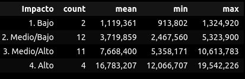

# Diplomatura en ciencia de datos, aprendizaje automático y sus aplicaciones - Edición 2023 - FAMAF (UNC)

## Mentoría 16 - ¿Cómo identificar fuga de ventas? Inteligencia artificial aplicada al sector comercial.

### Explorando Patrones de Datos a través de Clustering (TP3)

**Integrantes:**
- Canalis, Patricio.
- Chevallier-Boutell, Ignacio José.
- Villarroel Torrez, Daniel.

**Mentores:**
- Gonzalez, Lucía
- Lahoz, Nahuel

---
# Estructura de las notebooks

### **`tp3_clustering1.ipynb`** - Parte 1: Preparación y análisis de los datos
* Contiene todos los pasos necesarios para la curación, partiendo desde el dataset crudo (cada registro es una transacción) hasta llegar al dataset pivoteado (cada registro es un vendedor único por subrubro).
* El dataset pivoteado contiene las variaciones porcentuales intercuatrimestrales e interanuales.
* Son los mismos pasos que hicimos para el tp2, más el paso nuevo de mapear valores a 0 (ver paso 9).
* Además, contiene un análisis detallado del dataset resultante luego de la curación y antes de hacer cualquier agregación y pivotearlo, *i.e.* antes de ejecutar el paso 11. 
    * Análisis de variables categóricas.
    * Análisis de variables numéricas.
    * Análisis de la serie temporal.
* Al final hay una comparación entre los dataset pivoteados (tp2 vs tp3): medias y desviaciones estándares

### **`tp3_clustering2.ipynb`** - Parte 2: Análisis e imputación de NaNs
* Identificamos los datos faltantes, tanto globales como por subrubro. 
* Clasificamos los subrubros para vendedores que participan en más de uno. En función de esto, definimos reglas para conservar, desechar o imputar registros. 
* Se descartan todos los registros cuya decisión fue `Tirar`. Esto lleva a perder el único modelo de `Comb. Reventa`, por lo que se decide descartar este subrubro y quedarnos con los otros 10.
* Tests de imputación: se imputa con ceros o mediante KNN. Luego se reescalea con `MinMaxScaler`. Finalmente se prueba aplicando un PCA de 12 componentes y de 40 componentes.
* Se hace un estudio de la varianza explicada de PCA para cada caso.
* Análisis de métricas para K-means: se estudia la cantidad de clusters según el método del codo y el coeficiente de silueta.

### **`tp3_clustering3.ipynb`** - Parte 3: Clusterización con K-means y DBSCAN
* Clusterizamos con K-means usando $K=5$ y luego graficamos usando un PCA de 2 componentes.
* Determinamos el `eps` óptimo por subrubro para usar en DBSCAN.
* Clusterizamos usando DBSCAN con el `eps` óptimo para cada subrubro.

### **`tp3_clustering4.ipynb`** - Parte 4: Evaluación de resultados
* Al dataframe sobre el cual se realizó el clustering se le traen variables de interés como el promedio de ventas y comisiones y cantidad datos faltantes desde el dataset original. Y las columnas de variaciones porcentuales (para ventas/comisiones e intercuatrimestrales/interanuales).
* Se exploran las características distintivas de los dos clusters resultantes.
* Se evalúa la clusterización comparando contra las clases predefinidas de modelos.
* Se evalúa la consistencia en el armado de la variable modelo por parte del equipo de expertos de la empresa, para observar si coinciden con los datos.
* Se segmenta el grupo de vendedores fraudulentos en función al monto de las ventas de cada vendedor, para determinar el interés de la empresa en supervisarlos.

---
# Análisis de resultados

### Parte 1: Preparación y análisis de los datos
Cuando hacemos el análisis detallado del dataset resultante luego de la curación y antes de ejecutar el paso 11, vemos que no hay cambios apreciables respecto a sus resultados equivalentes del tp2. Sin embargo, cuando comparamos los datasets pivoteados entre el tp2 y el tp3, hay una clara variación tanto en las medias como en las desviaciones estándares gracias al nuevo paso de curación realizado. Ahora los datos son muchísimo menos ruidosos y presentan rangos de variación más acotados. Algunos subrubros presentan una mayor variación entre el tp2 y tp3 que otros: 'Farmacia', 'Comb.', 'Vehiculos', 'Tabaco' y 'Comb. Reventa' presentan las variaciones más leves. 

***Nota:*** Recordamos que la cantidad de subrubros con la que contamos es de 11: `Com. Varios`, `Comb.`, `Comb. Ley`, `Comb. Reventa`, `Farmacia`, `Gondola`, `Miscelaneo`, `Supermercados`, `Tabaco`, `Vehiculos` y `Venta Agrop.`.

### Parte 2: Análisis e imputación de NaNs
Al identificar los datos faltantes en el dataset pivoteado, vemos que hay de todo: desde 0 datos faltantes hasta casi la totalidad de datos faltantes. Incluso se presentan vendedores modelo con muchos datos faltantes. Notamos que en muchos casos se debe a que dichos vendedores participan en más de un subrubro.

Debido a esta participación de varios vendedores en más de un subrubro, tanto modelos como no modelo, se decidió clasificar su participación de la siguiente manera:
* Se asigna que el subrubro es **Primario** cuando
    * Es el único en el que participa.
    * Es el que tiene la menor cantidad de valores faltantes cuando participa en más de uno. Si la cantidad de faltantes es la misma en dos o más de los subrubros que participa, se define como **Primario** a aquel con mayor volumen de ventas.
* Se asigna que el subrubro es **Secundario** cuando no satisface lo recién dicho.

Estas decisiones se asignan a una nueva variable: `Tipo_subrubro`. Posteriormente, se consideraron en conjunto las variables `Tipo_subrubro`, `Modelo` y `Vacios`, la cual cuenta la cantidad de datos faltantes, para establecer una decisión: `No hacer nada`, `Imputar` o `Tirar`. El sistema de decisiones funciona de la siguiente manera:

| Modelo | Tipo_subrubro | Vacíos         | Decisión       |
|--------|---------------|----------------|----------------|
| 1      | Primario      | 0              | No hacer nada  |
| 1      | Primario      | Hasta 68 (50%) | Imputar        |
| 1      | Primario      | Más de 68      | Tirar          |
| 1      | Secundario    | 0              | No hacer nada  |
| 1      | Secundario    | Hasta 34 (25%) | Imputar        |
| 1      | Secundario    | Más de 34      | Tirar          |
| 0      | Primario      | 0              | No hacer nada  |
| 0      | Primario      | Hasta 14 (10%) | Imputar        |
| 0      | Primario      | Más de 14      | Tirar          |
| 0      | Secundario    | 0              | No hacer nada  |
| 0      | Secundario    | Hasta 7 (5%)   | Imputar        |
| 0      | Secundario    | Más de 7       | Tirar          |

***Nota:*** a modo de referencia son 136 las variables que contienen la variación porcentual.

Se procede a descartar todos aquellos registros que fueron asignados con `Decision` = `Tirar`. Luego de esto nos quedamos con:
* 3180 registros >> 30% menos.
* 46 vendedores únicos modelo >> 15% menos.
* 1 subrubro menos >> descartamos el subrubro `Comb. Reventa` ya que tenía un único vendedor modelo, pero el mismo fue descartado al tener 70 valores faltantes. Se intentó evitar descartarlo, analizando la posibilidad de combinar los subrubros asociados al combustible, pero tenían comportamientos muy disímiles entre sí.

Dentro de los registros asociados a los 10 subrubros restantes, aún se tienen valores faltantes. Se evalúa entonces el efecto de imputar con un valor constante de 0 o utilizando KNN con $k=5$. En cada caso se realiza además un PCA con 12 componentes. Para cada una de estas 4 situaciones (sólo imputar con 0, imputar con 0 y hacer PCA de 12 componentes, sólo imputar con KNN, e imputar con KNN y hacer PCA de 12 componentes) se calculó la inercia. En la siguiente figura vemos comparadas las inercias resultantes para las 4 situaciones. Si bien no se ve un codo bien definido, no pudiendo utilizar el método del codo para seleccionar una cantidad adecuada de clusters, observamos que la menor inercia se obtiene cuando se imputa con KNN y además se hace una reducción con PCA para quedarnos con las 12 componentes principales. Esto es un indicio de que esta es la mejor opción dentro de las 4 planteadas.

Respecto a la varianza, en la siguiente figura se muestra a modo de ejemplo los resultados obtenidos para la imputación con KNN y posterior uso de PCA sobre el total de variables disponibles. Vemos que, salvo para `Tabaco` que cumple casi con el 100%, la varianza explicada con 12 componentes es bastante pobre: va entre el 50 y el 75%. Sin embargo, al probar PCA con 40 componentes para asegurarnos de tener al menos el 80% de la varianza explicada en todos los subrubros, esto resulta en una clusterización aún más pobre: la inercia de este proceso es equivalente a la inercia obtenida cuando sólo se imputaba con 0. Esto se puede entender pensando en que el valor de 12 se adecua más a un proceso temporal (asociándolo a un año), mientras que con 40 comenzamos a conservar demasiado ruido. Esto último se puede observar al considerar las alturas de las barras en los histogramas de la figura a continuación.

Como el método del codo no nos sirve como métrica para decidir cuántos clusters utilizar, se probó el coeficiente de silueta. Determinamos primero el valor promedio del coeficiente de silueta para cada subrubro. En términos generales, los mejores puntajes se obtienen usando entre 2 y 5 clusters. En función de esto, analizamos los diagramas de silueta para cada subrubro, tomando de 2 a 5 clusters. Lo primero que salta a la vista es que todos los subrubros están sumamnete desbalanceados: la gran mayoría de los datos cae dentro de un cluster, y los demás clusters están conformados por una cantidad muy pequeña de datos. Además, hay muchos casos que presentan scores negativos, indicando una mala asignación del cluster. Finalmente, en todos los casos se presentan clusters que se ubican por debajo del valor promedio del coeficiente de silueta (líneas punteadas rojas), lo cual indica en principio que dichas clusterizaciones no son buenas. Esto se puede ver en el siguiente ejemplo, donde se ven los resultados para `Comb. Ley`.

A pesar de todo esto, los resultados tienen sentido si los enmarcamos en nuestro problema: el comportamiento fraudulento es raro y poco habitual, dando lugar a dataset extremadamente desbalanceados donde se presenta un grupo preponderante por sobre el resto.

### Parte 3: Clusterización con K-means y DBSCAN

Primero clusterizamos con K-means usando $K=5$ y, luego, grafiamos usando un PCA de 2 componentes. A modo de ejemplo, veamos el resultado para `Miscelaneo`. Vemos que todos los modelos (estrellas) pertenecen únicamente al cluster 1 (azul) y la mayor densidad de puntos se da en torno a éstos. Notamos que, al forzar 5 clusters, el algoritmo nos puede estar separando datos que en realidad no deberían separarse. Se podría plantear que los clusters 1 y 3 (azul y violeta) son en realidad el mismo cluster. Incluso podría incluirse el cluster 0 (rojo), quedando como cluster outliers el 2 y 4 (verde y naranja). 

Este patrón se repite para todos los subrubros. En base a esto, no consideramos que K-means sea el modelo de aprendizaje automático adecuado debido a la necesidad de una intervención humana post clusterizado para realizar una inspección visual y determinar manualmente qué conjunto de clusters consideramos indicadores de buen comportamiento y cuáles son outliers, *i.e.* debemos marcarlos y evaluarlos. Por este motivo, probamos con DBSCAN. 

Para clusterizar utilizando DBSCAN, primero determinamos el `eps` óptimo para cada subrubro, utilizando una regla análoga al método del codo. Obtenidos estos valores, se procede a clusterizar con DBSCAN y, luego, grafiamos usando un PCA de 2 componentes. A modo comparativo, se muestra el resultado obtenido para `Miscelaneo`. Vemos ahora que volvemos a tener una región densa y puntos dispersos. Además, se forma un único cluster, el cual contiene a los modelo. Aquellos puntos que no pertenecen a este cluster son outliers. 

Observamos entonces que DBSCAN es más útil ya que no requiere de una intervención humana. Los resultados de este modelo para cada subrubro se tabulan a continuación. Las variables son:
* $N_{tot}$ >> cantidad total de vendedores únicos presentes en dicho subrubro.
* $N_{mod}$ >> cantidad total de vendedores modelo presentes en dicho subrubro.
* $R_{mod}$ >> proporción de vendedores modelo en dicho subrubro.
    $$R_{mod} = \frac{N_{mod}}{N_{tot}} * 100$$
* $\epsilon$ >> parámetro `eps` para DBSCAN en dicho subrubro.
* $N_{min}$ >> parámetro `min_samples` para DBSCAN en dicho subrubro.
* $N_{out}$ >> cantidad total de vendedores outliers encontrados en dicho subrubro.
* $R_{out}$ >> proporción de vendedores outliers en dicho subrubro.
    $$R_{out} = \frac{N_{out}}{N_{tot}} * 100$$

|    Subrubro    | $N_{tot}$ | $N_{mod}$ | $R_{mod}$ |  $\epsilon$ | $N_{min}$ | $N_{out}$ | $R_{out}$ |
|----------------|-----------|-----------|-----------|-------------|-----------|-----------|-----------|
| Com. Varios    |    301    |     4     |   1.33 %  |     0.30    |     23    |     29    |   9.63 %  |
| Comb.          |    189    |     6     |   3.17 %  |     0.25    |     23    |     15    |   7.94 %  |
| Comb. Ley      |    195    |     3     |   1.54 %  |     0.60    |     23    |      5    |   2.56 %  |
| Farmacia       |    173    |     4     |   2.31 %  |     0.40    |     23    |     16    |   9.25 %  |
| Gondola        |    409    |     3     |   0.73 %  |     0.25    |     23    |     22    |   5.38 %  |
| Miscelaneo     |   1240    |    20     |   1.61 %  |     0.15    |     23    |     70    |   5.65 %  |
| Supermercados  |    136    |     2     |   1.47 %  |     0.35    |     23    |     18    |  13.24 %  |
| Tabaco         |     22    |     2     |   9.09 %  |     0.70    |     11    |      7    |  31.82 %  |
| Vehiculos      |    221    |     1     |   0.45 %  |     0.30    |     23    |     18    |   8.14 %  |
| Venta Agrop.   |    249    |     1     |   0.40 %  |     0.40    |     23    |     17    |   6.83 %  |

Esto es sobre un total de 3135 vendedores únicos con 46 modelos (1.47 % del total), dando un total de 217 outliers (6.92 % del total). En la siguiente figura se observa el clustering para `Tabaco`. Teniendo en cuenta esto junto a los resultados de la tabla, concluimos que necesitamos más datos para poder establecer un modelo útil para este subrubro, con lo cual se lo excluye del análisis.

Con respecto a los demás subrubros, vemos que casi todos tienen una proporción de vendedores outliers menor al 10%. Más aún: se cumple que $R_{out} = (8 \pm 3)$ %, siendo esperable que sea una cantidad pequeña al tratarse de situaciones fraudulentas, como habíamos dicho.

### Parte 4: Evaluación de resultados
Se recupera en un solo dataset la información de ventas/comisiones en pesos y la variación porcentual (interanual/intercuatrimestral). En primer lugar se evalúan las características distintivas de los dos clusters resultantes:
* El cluster -1 contiene a los outliers detectados mediante DBSCAN.
* El cluster 0 contiene a los demás vendedores, encontrándose aquí **TODOS** los vendedores marcados como modelo por parte del cliente.

En el siguiente ejemplo se grafican las medias y desviaciones estándar de las variaciones porcentuales (tanto de ventas como de comisiones, siendo intercuatrimestrales e interanuales) de `Com. Varios` (en adelante centramos la evaluación en este subrubro):

Se observa que la distribución del cluster 0 tiene menos variabilidad que el cluster -1. Analizando ahora sólo las medias, vemos claramente que tienden a ser más bajas para el cluster 0. Dicho de otro modo, aquellos etiquetados como -1 tienen en promedio variaciones porcentuales más eleveadas, lo cual tiene sentido si lo pensamos en términos de fraude: la variación porcentual es mayor al no haber declarado un mes y luego sí o viceversa.

Por otra parte se observa que la presencia de datos faltantes en el dataset no necesariamente está relacionada a casos fraudulentos:

No existe un patrón claro. En algunos subrubros (Miscelaneo, Vehiculos y Venta Agrop.) hay más faltantes en el cluster -1. Mientras que en el resto de los subrubros, la mayoría de faltantes ocurren en el cluster 0. Parecen estar más vinculados al subrubro particular.

Luego procedemos a comparar los clusters resultantes contra las clases definidas por el grupo de expertos de la empresa (la variable Modelo):

Observamos que los vendedores `Modelo` caen en el `Cluster 0`. Sin embargo, los `No Modelo` caen en ambos clusters. Lo cual tiene sentido, ya que el etiquetado de la variable Modelo no se hizo de manera exhaustiva sobre todos los vendedores, sino sobre una muestra. Esto es un caso típico de **positive unlabeling**.

Posteriormente se evalúa la consistencia de la variable Modelo. Es decir, si se condice con lo arrojado por los datos:

Salvo para el caso de `Supermercados`, se observa que los `Modelo` son más parecidos a los vendedores del `Cluster 0`, antes que al `Cluster -1`. Y en las variables de Comisión se observa más clara la diferencia, siendo que ésto se corresponde con la ganancia real de la empresa.

La siguiente pregunta que surgió fue saber si un vendedor que estaba clasificado como outlier en cierto subrubro, también era outlier en los demás subrubros a los que pertenecía. Vemos que poco más del 50% de dichos vendedores participa en más de un subrubro y las situaciones son de lo más diversas: hay quienes son outliers en todos sus subrubros, mientras que otros son outliers en alguno o sólo 1 subrubro.

Por último se enfoca el análisis en los vendedores que pertenecen al `Cluster -1`, para determinar qué interés tienen esos vendedores para la empresa y su potencial impacto. En particular, vamos a segmentar al cluster en diferentes partes según los montos de Ventas que generan. En la siguiente figura, la distribución (naranja) es aquella generada por los vendedores etiquetados como outliers para cada subrubro, mientras que las rectas verticales (azul, verde y rojo) marcan los cuartiles para la distribución global del subrubro, *i.e.* consideran tanto Cluster -1 como Cluster 0.

En base a esto, surgen 4 grupos de interés para cada subrubro, según el potencial impacto en la empresa entendiendo que el interés sobre un vendedor que vende poco y está fugando no es el mismo que sobre un vendedor que vende mucho. Para el caso de `Com. Varios` se tiene:

En total para todos los subrubros se tiene:
* 47 vendedores que por lo poco que venden, probablemente no sean de interés (se ubican debajo del cuartil 1 de su subrubro, considerando vendedores de todos los clusters).
* 128 vendedores (70 medio/bajo más 58 medio/alto) que por lo que venden, probablemente sean de interés medio (entre el cuartil 1 y 3 de su subrubro).
* 35 vendedores que por lo mucho que venden, problablemente sean de interés alto (se ubican por encima del cuartil 3 del subrubro).

---
# Conclusiones: accionables

Luego de un exahustivo análisis de los datos, incluyendo su curación y tratramiento, concluimos lo siguiente:
* Se logró segmentar a los vendedores en función de su comportamiento dentro de la plataforma de compra-venta online, logrando así detectar a aquellos que tienen un comportamiento potencialmente fraudulento.
* Esta segmentación fue efectiva en 9 subrubros: `Com. Varios`, `Comb.`, `Comb. Ley`, `Farmacia`, `Gondola`, `Miscelaneo`, `Supermercados`, `Vehiculos` y `Venta Agrop.`.
* Existe vendedores que han sido clasificados como fraudes en un subrubro, pero no así en los otros subrubros en los que participa.
* Las mayores diferencias entre aquellso etiquetados como fraudes y aquellos que no se observa en las comisiones, repercutiendo directamente en las ganancias de la empresa.

Finalmente, se hizo un ranking de impacto para cada uno de los subrubros con aquellos vendedores que fueron etiquetados como potenciales fraudes, permitiendo disernir entre aquellos que serían menos problemáticos para le empresa de aquellos que serían más problemáticos. Se entrega este ranking junto a los respectivos `ID` de los vendedores para que la empresa pueda tomar decisiones acorde a esta información.